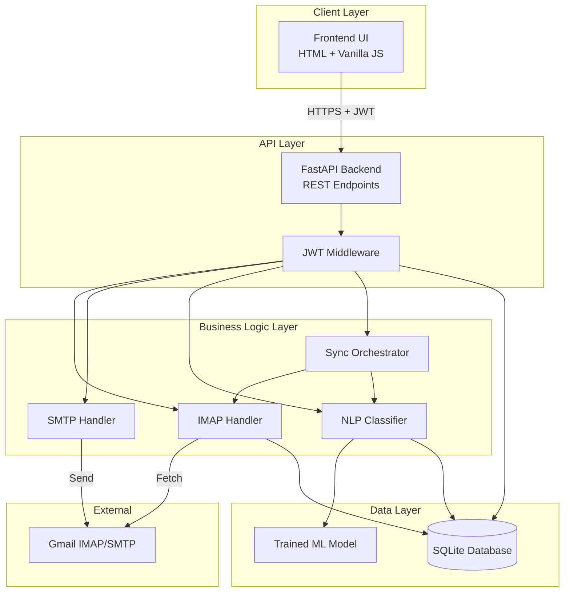
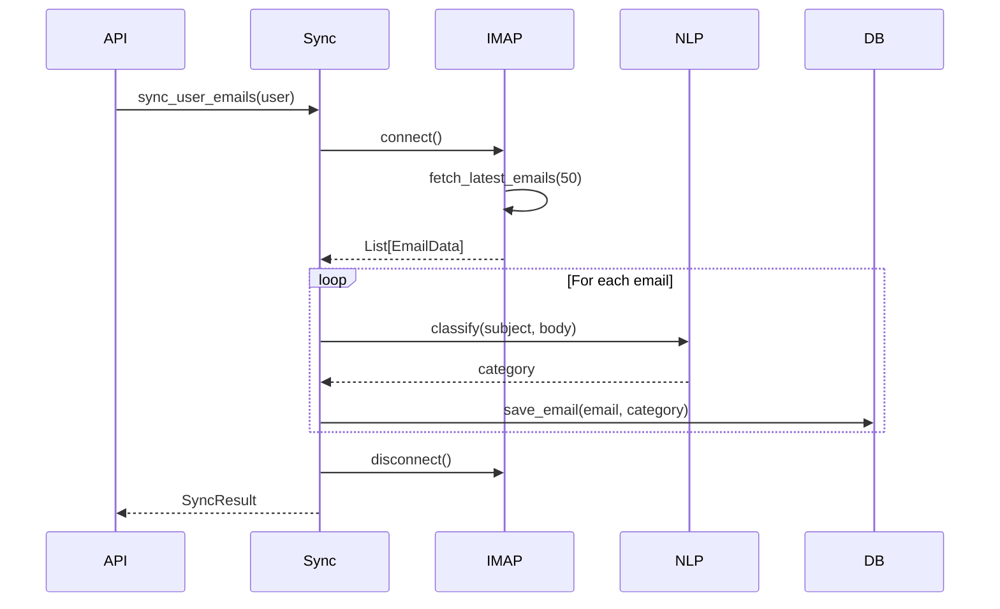

# Design Document

## Overview

The Local Email Manager is a privacy-first, offline-capable email management system built with Python FastAPI backend and vanilla JavaScript frontend. The system architecture follows a layered approach with clear separation between presentation (Frontend UI), business logic (Backend API), data access (Database Layer), and external integrations (IMAP/SMTP Handlers, NLP Classifier).

The system operates entirely on the user's local machine, fetching emails via IMAP, classifying them using a local scikit-learn model, and storing metadata in SQLite. All operations except email server communication happen offline, ensuring maximum privacy.

## Architecture

### High-Level Architecture



### Technology Stack

- **Backend**: Python 3.9+, FastAPI, Uvicorn
- **Frontend**: HTML5, CSS3, Vanilla JavaScript, Bootstrap 5
- **Database**: SQLite3 with SQLAlchemy ORM
- **NLP**: scikit-learn (TfidfVectorizer, MultinomialNB)
- **Email**: imaplib, smtplib (Python standard library)
- **Authentication**: PyJWT
- **Concurrency**: concurrent.futures.ThreadPoolExecutor

### Deployment Model

The system runs as a single-machine application:
- Backend server runs on `localhost:8000`
- Frontend served as static files from backend
- SQLite database stored in `./data/emails.db`
- ML model stored in `./models/classifier.pkl`

## Components and Interfaces

### 1. Backend API (main.py)

FastAPI application serving REST endpoints and static frontend files.

**Endpoints:**

```python
POST   /api/auth/login          # Authenticate user, return JWT
POST   /api/auth/register       # Register new user
GET    /api/emails              # List emails (paginated, filtered)
GET    /api/emails/{id}         # Get single email details
GET    /api/emails/search       # Search emails by query
POST   /api/emails/send         # Send new email
POST   /api/emails/sync         # Trigger IMAP sync
GET    /api/stats               # Get email statistics by category
```

**Request/Response Models:**

```python
# Login Request
{
    "email": "user@gmail.com",
    "password": "app_specific_password"
}

# Login Response
{
    "access_token": "eyJ0eXAiOiJKV1QiLCJhbGc...",
    "token_type": "bearer"
}

# Email List Response
{
    "emails": [
        {
            "id": 1,
            "sender": "sender@example.com",
            "subject": "Meeting Tomorrow",
            "category": "Work",
            "date": "2025-11-07T10:30:00",
            "preview": "First 100 chars of body..."
        }
    ],
    "total": 150,
    "page": 1,
    "page_size": 20
}

# Send Email Request
{
    "to": "recipient@example.com",
    "subject": "Hello",
    "body": "Email content here"
}

# Sync Response
{
    "status": "success",
    "fetched": 15,
    "classified": 15,
    "errors": []
}
```

### 2. Authentication Module (auth.py)

Handles user authentication and JWT token management.

**Interface:**

```python
class AuthManager:
    def __init__(self, secret_key: str, algorithm: str = "HS256"):
        """Initialize with JWT secret and algorithm"""
        
    def create_access_token(self, user_id: str, expires_delta: timedelta) -> str:
        """Generate JWT token for authenticated user"""
        
    def verify_token(self, token: str) -> dict:
        """Validate JWT token and extract payload"""
        
    def hash_password(self, password: str) -> str:
        """Hash password using bcrypt"""
        
    def verify_password(self, plain_password: str, hashed_password: str) -> bool:
        """Verify password against hash"""
```

**Design Decisions:**
- Use bcrypt for password hashing (secure, industry standard)
- JWT tokens expire after 24 hours
- Store hashed passwords in users table
- Secret key loaded from environment variable

### 3. IMAP Handler (imap_handler.py)

Manages email fetching from Gmail IMAP server.

**Interface:**

```python
class IMAPHandler:
    def __init__(self, email: str, password: str):
        """Initialize with user credentials"""
        
    def connect(self) -> bool:
        """Connect to Gmail IMAP server (imap.gmail.com:993)"""
        
    def fetch_latest_emails(self, count: int = 50) -> List[EmailData]:
        """Fetch latest N emails from inbox"""
        
    def disconnect(self):
        """Close IMAP connection"""
        
    def _parse_email(self, raw_email: bytes) -> EmailData:
        """Parse raw email into structured data"""
```

**EmailData Structure:**

```python
@dataclass
class EmailData:
    sender: str
    subject: str
    body: str
    date: datetime
    message_id: str  # For deduplication
```

**Design Decisions:**
- Use SSL connection (port 993) for security
- Fetch only plain text body (ignore HTML)
- Extract message_id to prevent duplicate storage
- Implement connection timeout (30 seconds)
- Use context manager pattern for automatic cleanup

### 4. SMTP Handler (smtp_handler.py)

Manages email sending via Gmail SMTP server.

**Interface:**

```python
class SMTPHandler:
    def __init__(self, email: str, password: str):
        """Initialize with user credentials"""
        
    def send_email(self, to: str, subject: str, body: str) -> bool:
        """Send email via SMTP"""
        
    def _create_message(self, to: str, subject: str, body: str) -> MIMEText:
        """Create MIME message"""
```

**Design Decisions:**
- Use TLS connection (smtp.gmail.com:587)
- Send plain text emails only (MVP scope)
- Implement retry logic (max 3 attempts)
- Log all send attempts for debugging

### 5. NLP Classifier (classifier.py)

Local machine learning model for email classification.

**Interface:**

```python
class EmailClassifier:
    CATEGORIES = ["Work", "Personal", "Spam", "Promotions"]
    
    def __init__(self, model_path: str = "./models/classifier.pkl"):
        """Load or initialize classifier"""
        
    def train(self, training_data: List[Tuple[str, str]]):
        """Train model on labeled data (text, category)"""
        
    def classify(self, subject: str, body: str) -> str:
        """Classify email and return category"""
        
    def save_model(self):
        """Persist trained model to disk"""
        
    def load_model(self):
        """Load trained model from disk"""
```

**ML Pipeline:**

```python
# Feature extraction
vectorizer = TfidfVectorizer(
    max_features=1000,
    stop_words='english',
    ngram_range=(1, 2)
)

# Classifier
classifier = MultinomialNB(alpha=0.1)

# Combined pipeline
pipeline = Pipeline([
    ('vectorizer', vectorizer),
    ('classifier', classifier)
])
```

**Training Data Format:**

```python
training_data = [
    ("Meeting at 3pm tomorrow", "Work"),
    ("Your package has shipped", "Personal"),
    ("Congratulations! You won $1000", "Spam"),
    ("50% off sale this weekend", "Promotions"),
    # ... more examples
]
```

**Design Decisions:**
- Combine subject + body for classification input
- Use TF-IDF for feature extraction (handles varying text lengths)
- MultinomialNB chosen for speed and effectiveness on text
- Include bigrams to capture phrases like "meeting tomorrow"
- Pre-train with 100+ labeled examples (expandable)
- Store model as pickle file for persistence

### 6. Database Layer (database.py)

SQLite database with SQLAlchemy ORM for data persistence.

**Schema:**

```sql
CREATE TABLE users (
    id INTEGER PRIMARY KEY AUTOINCREMENT,
    email TEXT UNIQUE NOT NULL,
    password_hash TEXT NOT NULL,
    created_at TIMESTAMP DEFAULT CURRENT_TIMESTAMP
);

CREATE TABLE emails (
    id INTEGER PRIMARY KEY AUTOINCREMENT,
    user_id INTEGER NOT NULL,
    message_id TEXT NOT NULL,
    sender TEXT NOT NULL,
    subject TEXT NOT NULL,
    body TEXT NOT NULL,
    category TEXT NOT NULL,
    date TIMESTAMP NOT NULL,
    created_at TIMESTAMP DEFAULT CURRENT_TIMESTAMP,
    FOREIGN KEY (user_id) REFERENCES users(id),
    UNIQUE(user_id, message_id)
);

CREATE INDEX idx_user_category ON emails(user_id, category);
CREATE INDEX idx_user_date ON emails(user_id, date DESC);
CREATE INDEX idx_user_sender ON emails(user_id, sender);
```

**SQLAlchemy Models:**

```python
class User(Base):
    __tablename__ = "users"
    id = Column(Integer, primary_key=True)
    email = Column(String, unique=True, nullable=False)
    password_hash = Column(String, nullable=False)
    created_at = Column(DateTime, default=datetime.utcnow)
    emails = relationship("Email", back_populates="user")

class Email(Base):
    __tablename__ = "emails"
    id = Column(Integer, primary_key=True)
    user_id = Column(Integer, ForeignKey("users.id"), nullable=False)
    message_id = Column(String, nullable=False)
    sender = Column(String, nullable=False)
    subject = Column(String, nullable=False)
    body = Column(Text, nullable=False)
    category = Column(String, nullable=False)
    date = Column(DateTime, nullable=False)
    created_at = Column(DateTime, default=datetime.utcnow)
    user = relationship("User", back_populates="emails")
```

**Database Interface:**

```python
class DatabaseManager:
    def __init__(self, db_path: str = "./data/emails.db"):
        """Initialize database connection"""
        
    def create_user(self, email: str, password_hash: str) -> User:
        """Create new user"""
        
    def get_user_by_email(self, email: str) -> Optional[User]:
        """Retrieve user by email"""
        
    def save_email(self, email_data: EmailData, user_id: int, category: str):
        """Save email to database"""
        
    def get_emails(self, user_id: int, category: str = None, 
                   page: int = 1, page_size: int = 20) -> List[Email]:
        """Get paginated emails for user"""
        
    def search_emails(self, user_id: int, query: str) -> List[Email]:
        """Search emails by subject or sender"""
        
    def get_email_stats(self, user_id: int) -> dict:
        """Get count of emails by category"""
```

**Design Decisions:**
- Use UNIQUE constraint on (user_id, message_id) to prevent duplicates
- Index on (user_id, category) for fast filtering
- Index on (user_id, date DESC) for chronological listing
- Store full email body for search functionality
- Use foreign key constraints for referential integrity

### 7. Sync Orchestrator (sync_orchestrator.py)

Coordinates concurrent email synchronization for multiple users.

**Interface:**

```python
class SyncOrchestrator:
    def __init__(self, max_workers: int = 5):
        """Initialize with thread pool"""
        self.executor = ThreadPoolExecutor(max_workers=max_workers)
        
    def sync_user_emails(self, user: User) -> SyncResult:
        """Sync emails for single user"""
        
    def sync_multiple_users(self, users: List[User]) -> List[SyncResult]:
        """Sync emails for multiple users concurrently"""
        
    def _sync_worker(self, user: User) -> SyncResult:
        """Worker function for thread pool"""
```

**Sync Process Flow:**



**Design Decisions:**
- Limit thread pool to 5 workers to prevent resource exhaustion
- Each sync operation runs in isolated thread
- Use database connection pooling for thread safety
- Implement timeout for sync operations (5 minutes max)
- Return detailed sync results (success count, errors)

### 8. Frontend UI

Single-page application using vanilla JavaScript and Bootstrap.

**Pages:**

1. **login.html** - Authentication page
2. **inbox.html** - Main email interface

**Key JavaScript Modules:**

```javascript
// api.js - API client
class APIClient {
    constructor(baseURL) {
        this.baseURL = baseURL;
        this.token = localStorage.getItem('token');
    }
    
    async login(email, password) { }
    async getEmails(page, category) { }
    async searchEmails(query) { }
    async sendEmail(to, subject, body) { }
    async syncEmails() { }
}

// inbox.js - Inbox page logic
class InboxManager {
    constructor(apiClient) { }
    
    async loadEmails(page, category) { }
    async handleSearch(query) { }
    async handleCategoryFilter(category) { }
    async handleCompose(emailData) { }
    async handleSync() { }
    renderEmailList(emails) { }
    renderEmailDetail(email) { }
}
```

**UI Components:**

- Navigation bar with sync button and logout
- Category filter buttons (All, Work, Personal, Spam, Promotions)
- Search bar with real-time filtering
- Email list table (sender, subject, category, date)
- Email detail modal
- Compose email modal
- Loading indicators for async operations
- Toast notifications for success/error messages

**Design Decisions:**
- Use Bootstrap 5 for responsive design
- Store JWT in localStorage (cleared on logout)
- Implement client-side pagination
- Use fetch API for HTTP requests
- Add loading states for better UX
- Implement error handling with user-friendly messages

## Data Models

### User Model

```python
{
    "id": 1,
    "email": "user@gmail.com",
    "password_hash": "$2b$12$...",
    "created_at": "2025-11-07T10:00:00"
}
```

### Email Model

```python
{
    "id": 1,
    "user_id": 1,
    "message_id": "<unique-id@mail.gmail.com>",
    "sender": "sender@example.com",
    "subject": "Project Update",
    "body": "Full email body text...",
    "category": "Work",
    "date": "2025-11-07T09:30:00",
    "created_at": "2025-11-07T10:00:00"
}
```

### JWT Payload

```python
{
    "sub": "user@gmail.com",  # Subject (user identifier)
    "user_id": 1,
    "exp": 1699372800,        # Expiration timestamp
    "iat": 1699286400         # Issued at timestamp
}
```

## Error Handling

### Error Response Format

All API errors return consistent JSON structure:

```python
{
    "error": "error_code",
    "message": "Human-readable error message",
    "details": {}  # Optional additional context
}
```

### Error Categories

**Authentication Errors (401):**
- `invalid_credentials` - Wrong email/password
- `token_expired` - JWT token expired
- `token_invalid` - Malformed or invalid token

**Authorization Errors (403):**
- `access_denied` - User lacks permission

**Validation Errors (400):**
- `invalid_input` - Malformed request data
- `missing_field` - Required field not provided

**Server Errors (500):**
- `imap_connection_failed` - Cannot connect to email server
- `smtp_send_failed` - Email sending failed
- `database_error` - Database operation failed
- `classification_error` - NLP model error

### Error Handling Strategy

**Backend:**
- Use FastAPI exception handlers for consistent responses
- Log all errors with stack traces
- Implement retry logic for transient failures (IMAP/SMTP)
- Graceful degradation (continue sync even if some emails fail)

**Frontend:**
- Display toast notifications for errors
- Show specific error messages from API
- Implement retry buttons for failed operations
- Maintain UI state during errors

## Testing Strategy

### Unit Tests

**Backend Components:**
- `test_auth.py` - Authentication and JWT validation
- `test_imap_handler.py` - Email fetching logic (mocked IMAP)
- `test_smtp_handler.py` - Email sending logic (mocked SMTP)
- `test_classifier.py` - NLP classification accuracy
- `test_database.py` - Database operations and queries

**Test Framework:** pytest with coverage reporting

**Mocking Strategy:**
- Mock IMAP/SMTP connections using unittest.mock
- Use in-memory SQLite for database tests
- Mock trained ML model for classifier tests

### Integration Tests

**API Endpoint Tests:**
- `test_api_auth.py` - Login/register flows
- `test_api_emails.py` - Email CRUD operations
- `test_api_sync.py` - Sync orchestration

**Test Approach:**
- Use FastAPI TestClient
- Create test database for each test
- Test full request/response cycle
- Verify JWT authentication on protected routes

### Frontend Tests

**Manual Testing Checklist:**
- Login with valid/invalid credentials
- View email list with pagination
- Filter by category
- Search emails
- Compose and send email
- Trigger sync operation
- Logout and verify token cleared

**Future Enhancement:** Add Selenium/Playwright for automated UI tests

### Performance Tests

**Concurrent Sync Test:**
- Simulate 10 users syncing simultaneously
- Verify thread pool handles load
- Check database connection pooling
- Measure sync completion time

**Database Query Performance:**
- Test pagination with 10,000+ emails
- Verify index usage with EXPLAIN QUERY PLAN
- Measure search query response time

### Test Data

**Sample Training Data:**
- 100+ labeled emails across 4 categories
- Balanced distribution (25 per category)
- Real-world examples from public datasets

**Test Users:**
- Create test Gmail accounts with app passwords
- Use test data for IMAP/SMTP integration tests

## Security Considerations

1. **Password Storage:** Use bcrypt with salt for hashing
2. **JWT Secret:** Load from environment variable, never commit
3. **HTTPS:** Recommend running behind reverse proxy with SSL
4. **Input Validation:** Sanitize all user inputs to prevent injection
5. **Rate Limiting:** Implement rate limiting on login endpoint
6. **CORS:** Configure CORS to allow only localhost origin
7. **SQL Injection:** Use parameterized queries via SQLAlchemy
8. **XSS Prevention:** Escape HTML in email body display

## Deployment Instructions

### Prerequisites

- Python 3.9+
- pip package manager
- Gmail account with app-specific password enabled

### Installation Steps

```bash
# Clone repository
git clone <repo-url>
cd email-mvp

# Create virtual environment
python -m venv venv
source venv/bin/activate  # Windows: venv\Scripts\activate

# Install dependencies
pip install -r backend/requirements.txt

# Set environment variables
export JWT_SECRET="your-secret-key-here"
export DATABASE_PATH="./data/emails.db"

# Initialize database
python backend/database.py --init

# Train initial classifier
python backend/classifier.py --train

# Run server
uvicorn backend.main:app --host 127.0.0.1 --port 8000
```

### Access Application

Open browser to `http://localhost:8000`

## Future Enhancements

1. **Email Threading:** Group related emails into conversations
2. **Attachments:** Support downloading and viewing attachments
3. **Rich Text:** Support HTML email rendering
4. **Notifications:** Desktop notifications for new emails
5. **Offline Mode:** Service worker for offline access
6. **Export:** Export emails to CSV/JSON
7. **Advanced Search:** Full-text search with filters
8. **Custom Categories:** Allow users to define custom categories
9. **Auto-Reply:** Template-based auto-reply functionality
10. **Mobile App:** React Native mobile client
